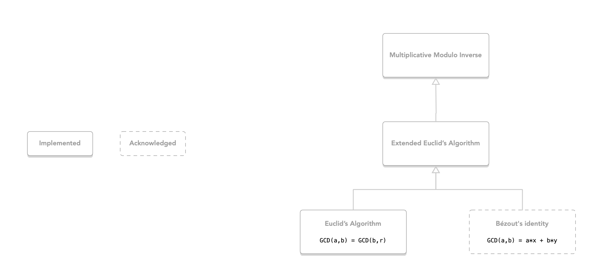

# SwfitCryptography

This repository serves to implement cryptography concepts for educational/learning purposes using the Swfit programming language.

# Overview

# Acronyms

|   |  |
| ------------- | ------------- |
| GCD  | Greatest Common Denominator  |
